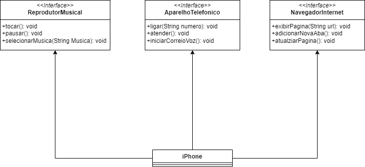

# Diagramação de classes do iPhone

## Descrição

Neste repositório, está disponível uma implementação detalhada de um desafio de modelagem de software, cujo objetivo é representar, de maneira precisa e abrangente, as funcionalidades de um iPhone. O projeto aplica princípios de programação orientada a objetos e técnicas de modelagem UML para desenvolver uma estrutura robusta e versátil, permitindo que o dispositivo iPhone desempenhe três funções essenciais e distintas: Reprodutor de Música, Aparelho Telefônico e Navegador de Internet.

## Diagrama UML

  

### Reprodutor Musical

Métodos: tocar(), pausar(), selecionarMusica(String musica)

### Aparelho Telefonico

Métodos: ligar(String numero), atender(), iniciarCorreioVoz()

### Navegador na Internet

Métodos: exibirPagina(String url), adicionarNovaAba(), atualizarPagina()

### iPhone

A classe `iPhone` é a classe principal que representa o dispositivo. Ela implementa as interfaces `ReprodutorMusical`, `AparelhoTelefonico` e `NavegadorInternet`. Isso permite que o iPhone desempenhe os papéis de reprodutor musical, aparelho telefônico e navegador na Internet. Sendo testando cada um deles.

Para acessar Diagrama UML [clique aqui](docs/iPhone-modelagem.pdf) para ser redirecionado ao arquivo PDF.